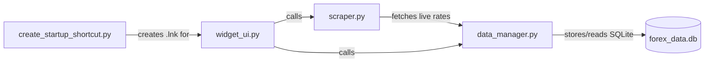

# Forex Tracker — Code Review & Validation

## What the Application Does

This is a **Windows desktop widget** that tracks the daily **USD → INR "CCY Buy" exchange rate** from two Indian banks — **HDFC Bank** and **Axis Bank** — and displays it as a small, always-visible, frameless floating window on your desktop.

### Architecture (4 files)

---

### File-by-File Breakdown

#### 1. [scraper.py](file:///d:/Documents/Python%20Projects/Forex%20Tracker/scraper.py) — Web Scraping

| Function | Source | Method |
|---|---|---|
| `get_axis_bank_usd_buy()` | Axis Bank corporate card rate page (HTML) | Fetches the HTML page, parses the `<table>`, finds the USD row, and extracts the **7th numeric value** (index 6) which corresponds to the "CCY BUY" column. |
| `get_hdfc_bank_usd_buy()` | HDFC Bank treasury forex card rates (PDF) | Downloads a PDF, extracts text with `pdfplumber`, finds the line containing `USD` + `UnitedStatesDollar`, and extracts the **7th numeric value** after `USD` — which maps to the "Forex Cards (Cash Out)" rate. A sanity check ensures the rate is between ₹50–₹150. |

Both functions return a `float` on success or `None` on failure.

---

#### 2. [data_manager.py](file:///d:/Documents/Python%20Projects/Forex%20Tracker/data_manager.py) — SQLite Persistence

| Function | Purpose |
|---|---|
| `init_db()` | Creates the `rates` table if it doesn't exist. Schema: `(date TEXT, bank TEXT, currency TEXT, rate REAL)` with a unique constraint on `(date, bank, currency)`. |
| `save_rate(bank, currency, rate)` | Inserts today's rate. Uses `INSERT OR REPLACE` so re-fetching on the same day updates the value rather than failing. |
| `get_trend(bank, currency, days=30)` | Returns up to the last 30 days of `(dates, rates)` for graphing. |

The database file path is resolved as an **absolute path** relative to the script's own directory, so it works correctly regardless of the working directory at launch time.

---

#### 3. [widget_ui.py](file:///d:/Documents/Python%20Projects/Forex%20Tracker/widget_ui.py) — PyQt6 Desktop Widget

This is the main entry point. It creates a **frameless, translucent, draggable floating window** that:

- Shows today's HDFC and Axis USD buy rates as text labels
- Renders a **trend graph** (via `pyqtgraph`) with the last 30 days of data
- Has a **refresh button** (⟳) to re-fetch rates on demand
- Has a **close button** (×)
- Auto-refreshes every **12 hours** via `QTimer`
- Uses `WindowStaysOnBottomHint` so it behaves like a desktop widget (sits behind other windows)
- Data fetching runs on a **background `QThread`** so the UI never freezes

---

#### 4. [create_startup_shortcut.py](file:///d:/Documents/Python%20Projects/Forex%20Tracker/create_startup_shortcut.py) — Windows Startup

Creates a `.lnk` shortcut in the Windows Startup folder pointing to `venv\Scripts\pythonw.exe` (the silent/no-console Python) running `widget_ui.py`. This makes the widget launch automatically on login.

---

## Validation Results

All checks passed ✅

| Check | Result |
|---|---|
| **Syntax** — `py_compile` on all `.py` files | ✅ No errors |
| **Axis Bank scraper** | ✅ Returned `93.82` |
| **HDFC Bank scraper** | ✅ Returned `93.71` |
| **Axis Bank URL reachable** | ✅ HTTP 200 |
| **HDFC Bank URL reachable** | ✅ HTTP 200 |
| **Database init** | ✅ Table created |
| **Database read** | ✅ Returns `(['2026-05-14'], [93.71])` for HDFC |
| **All dependencies importable** | ✅ `PyQt6`, `pyqtgraph`, `requests`, `bs4`, `pdfplumber` |
| **Widget UI launches** | ✅ Opens without errors |

> [!NOTE]
> The scraper relies on **specific HTML/PDF table layouts** from the bank websites. If either bank redesigns their page or changes the column order, the hardcoded index (`rates[6]`) may extract the wrong value or return `None`. This is an inherent fragility of web scraping — something to be aware of but not a bug today.

> [!TIP]
> The `get_trend` query uses `ORDER BY date ASC LIMIT 30`, which returns the **oldest** 30 records, not the **most recent** 30. Once you have more than 30 days of data, the graph will stop showing recent dates. This should be changed to a subquery or `DESC`/reverse approach if you plan to use this long-term. Since you only have 1 day of data currently, it works fine for now.
